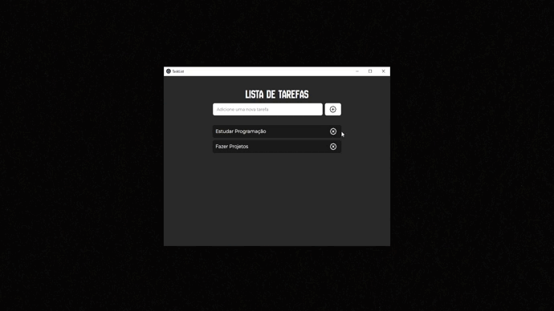

# TaskList-FrontEnd-BackEnd

## Descrição

**TaskList-FrontEnd-BackEnd** é uma aplicação que gerencia tarefas, composta por uma API backend e uma interface frontend. O backend é responsável por configurar o servidor, autenticação e operações de CRUD para as tarefas. O frontend fornece uma interface de usuário intuitiva e interativa para realizar essas operações, e o projeto também utiliza Electron para criar uma aplicação desktop com React.

## Tecnologias Utilizadas

### Backend

- **Fastify**: Framework web rápido e leve para Node.js, utilizado para configurar o servidor e gerenciar as rotas da API.
- **@fastify/jwt**: Plugin para autenticação via JSON Web Tokens (JWT), permitindo o gerenciamento seguro de sessões de usuário.
- **@fastify/cors**: Plugin para permitir requisições Cross-Origin Resource Sharing (CORS), possibilitando o acesso à API a partir de diferentes domínios.
- **Prisma**: ORM (Object-Relational Mapping) para interagir com o banco de dados de maneira eficiente e segura.

### Frontend

- **React**: Biblioteca JavaScript para construir interfaces de usuário dinâmicas e responsivas.
- **Shadcn/UI**: Biblioteca de componentes UI que inclui elementos visuais como botões e áreas de rolagem, proporcionando uma experiência de usuário consistente e moderna.
- **Lucide React**: Biblioteca de ícones React que oferece ícones personalizados para enriquecer a interface da aplicação.
- **Electron**: Framework para criar aplicações desktop usando tecnologias web como HTML, CSS e JavaScript. Permite que o frontend React funcione como uma aplicação de desktop.

## Estrutura do Projeto

- **Backend**:

  - Configura o servidor usando Fastify.
  - Gerencia a autenticação e a autorização de usuários com JWT.
  - Fornece endpoints para operações de CRUD (Create, Read, Update, Delete) relacionadas às tarefas.

- **Frontend**:
  - Implementa uma interface de usuário com React.
  - Utiliza componentes de UI do Shadcn e ícones do Lucide React.
  - Conecta-se ao backend para realizar operações de CRUD nas tarefas e exibir as informações de maneira interativa.
  - Utiliza Electron para criar uma aplicação desktop com a interface React.

## Como Executar o Projeto

1. **Backend**:

   - Navegue até o diretório do backend.
   - Instale as dependências com `npm install`.
   - Inicie o servidor com `node server.js`.

2. **Frontend**:

   - Navegue até o diretório do frontend.
   - Instale as dependências com `npm install`.
   - Inicie a aplicação com `npm start`.

3. **Aplicação Desktop (Electron)**:
   - Navegue até o diretório do frontend.
   - Instale as dependências com `npm install`.
   - Compile a aplicação com `npm run build`.
   - Inicie a aplicação desktop com `npm run electron`.

## Projeto

## Contribuição

Se desejar contribuir para o projeto, por favor, siga as etapas abaixo:

1. Faça um fork do repositório.
2. Crie uma nova branch para sua alteração: `git checkout -b minha-alteracao`.
3. Faça as alterações e commit: `git commit -am 'Adiciona nova funcionalidade'`.
4. Envie sua branch para o repositório remoto: `git push origin minha-alteracao`.
5. Crie um Pull Request explicando suas alterações.

## Contato

Para dúvidas ou mais informações, entre em contato com [Luis Felipe Ribeiro de Paula](mailto:fefedias2005@gmail.com).
